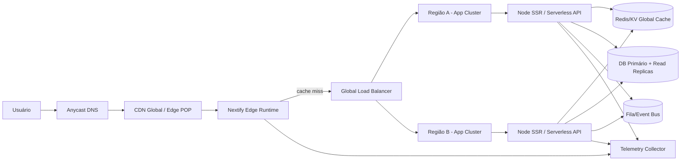
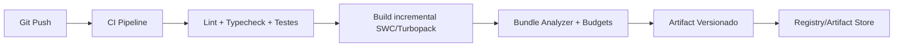
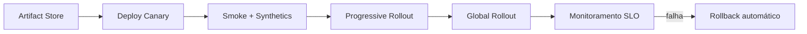

# Nextify.js — Documento Técnico de Arquitetura (Big Tech Style)

## 0) Resumo Executivo

**Nextify.js** é um framework React full-stack projetado para superar os limites de frameworks atuais em três eixos centrais:

1. **Performance extrema** em build, dev e runtime (Node e Edge).
2. **Escalabilidade operacional** para aplicações globais com renderização híbrida.
3. **Developer Experience de alto nível** com ergonomia de produto e extensibilidade real.

A plataforma combina:

- **Roteamento baseado em arquivos** com segmentação estática/dinâmica.
- **SSR, SSG, ISR e Streaming SSR (React 18+)** em um motor unificado.
- **Execução híbrida Node + Edge** com política automática de posicionamento.
- **Pipeline de build incremental** com compilação SWC/Rust e bundling Turbopack/Vite.
- **Camadas inteligentes de cache** (CDN, edge cache, server cache, data cache).
- **Plugins e hooks de compilação/runtime** para extensibilidade empresarial.

---

## 1) Visão Geral do Framework Nextify.js

### 1.1 Objetivos de Produto

- Reduzir **TTFB**, **LCP** e tempo de hidratação em aplicações React de médio e grande porte.
- Entregar **experiência de desenvolvimento instantânea** (hot reload real, startup rápido, rebuild seletivo).
- Padronizar execução em **serverless e edge** sem complexidade para o desenvolvedor.
- Oferecer arquitetura “**default secure**” e otimizações automáticas.

### 1.2 Princípios de Arquitetura

- **Server-first rendering** com fallback inteligente para client components.
- **Incrementalidade em tudo**: build, cache, invalidation, e revalidation.
- **Observabilidade nativa** (traces, logs estruturados, métricas de rota/render/data).
- **API composable**: recursos core simples + capacidades avançadas por plugin.

### 1.3 Funcionalidades Core

- File-based routing.
- SSR, SSG, ISR.
- Streaming SSR com React 18+.
- Edge rendering.
- Middleware.
- API Routes integradas.
- Sistema de plugins.
- Otimização automática de imagens.
- Code splitting automático.
- Lazy loading inteligente.
- Dev server ultra rápido.
- Hot reload instantâneo.
- Deploy serverless.
- Cache inteligente.

---

## 2) Arquitetura Técnica do Framework

## 2.1 Macroarquitetura

```text
nextify/
  cli/                 # scaffolding, build/dev/start commands
  compiler/            # SWC/Rust transforms + analyzer
  bundler-adapter/     # Turbopack/Vite abstraction
  router/              # file-system routing graph + matcher
  runtime/
    server/            # Node runtime (SSR, API routes)
    edge/              # Edge runtime (middleware + edge SSR)
    client/            # hydration/runtime client
  rendering-engine/    # SSR/SSG/ISR/Streaming orchestration
  data-cache/          # caching + revalidation layer
  image-optimizer/     # image pipeline
  plugin-system/       # plugin hooks and lifecycle
  observability/       # tracing, logging, metrics
```

## 2.2 Camadas Principais

1. **Camada de Entrada (CLI + Config):** resolve projeto, carrega `nextify.config.ts`, plugins e ambiente.
2. **Camada de Compilação:** transpila TS/JSX, aplica transforms React, remove dead code, gera chunks.
3. **Camada de Roteamento:** constrói o grafo de rotas do filesystem e metadados de rendering.
4. **Camada de Renderização:** decide SSR/SSG/ISR/Edge por rota e executa pipeline.
5. **Camada de Runtime:** Node ou Edge executa handlers, middleware e API routes.
6. **Camada de Cache e Dados:** controla cache keys, TTL, tags e invalidação.
7. **Camada de Observabilidade:** exporta traces OpenTelemetry-like e métricas por request.

## 2.3 Modelo de Execução por Request

1. Request entra em CDN/Edge POP.
2. Middleware é executado (auth, geo, A/B, rewrites).
3. Router resolve rota + estratégia de render.
4. Cache lookup multinível (edge/server/data).
5. Se miss: rendering engine executa SSR/streaming/ISR regeneration.
6. Resposta serializada, comprimida e cacheada com políticas dinâmicas.
7. Métricas e traces são emitidos.

---

## 3) Contribuição Técnica de Cada Especialista

## 3.1 Principal Software Architect

- Define arquitetura hexagonal do core com boundaries explícitos (`router`, `rendering`, `runtime`, `cache`).
- Estabelece contratos estáveis entre módulos (interfaces versionadas).
- Define estratégia de compatibilidade e roadmap de releases semânticos.
- Formaliza RFC process para features sensíveis (edge consistency, plugin API).

## 3.2 React Core Engineer

- Implementa integração avançada com React 18+ (Streaming SSR, Suspense boundaries, selective hydration).
- Define convenções de **Server Components-ready** para evolução futura.
- Otimiza hidratação parcial e priorização de eventos de interatividade.

## 3.3 JavaScript Compiler Engineer

- Constrói pipeline SWC/Rust para transforms de JSX/TS e otimizações de produção.
- Implementa static analysis para detectar split points automáticos e imports lazy.
- Cria mecanismo de incremental compilation com cache de AST e artifact hashing.

## 3.4 Web Performance Specialist

- Define budgets de performance por rota (JS payload, LCP, TBT, INP).
- Implementa prefetch adaptativo com base em viewport, rede e probabilidade de navegação.
- Lidera image pipeline (format negotiation AVIF/WebP, responsive srcset, quality auto).

## 3.5 DevOps / Infrastructure Engineer

- Projeta runtime dual Node/Edge e deploy serverless multi-provider.
- Define estratégia de cold-start mitigation (bundle minimization + warm paths).
- Implementa observabilidade distribuída e mecanismos de rollback seguro.

## 3.6 Developer Experience Engineer

- Cria CLI (`create-nextify-app`, `nextify dev/build/start`).
- Implementa error overlay de alta qualidade com source maps confiáveis.
- Simplifica configuração com defaults progressivos e migração assistida.

## 3.7 Security Engineer

- Aplica baseline de segurança: CSP templates, headers seguros, SSRF guards.
- Define isolamento de middleware/plugins com permissões declarativas.
- Constrói sistema de auditoria de dependências e políticas de assinatura de plugins.

---

## 4) Estrutura de Pastas do Framework

```text
nextify-project/
  app/                        # rotas e layouts (file-based routing)
    layout.tsx
    page.tsx
    about/page.tsx
    blog/
      [slug]/page.tsx
  api/
    users/route.ts            # API Routes integradas
  middleware.ts               # middleware global
  public/
    images/
  plugins/
    analytics.plugin.ts
  nextify.config.ts
  tsconfig.json
  package.json

  .nextify/
    cache/
    build-manifest.json
    routes-manifest.json
    traces/
```

### Convenções de Rota

- `page.tsx`: endpoint renderizável.
- `layout.tsx`: layout persistente por segmento.
- `[id]`: segmento dinâmico.
- `(group)`: group sem impacto na URL.
- `route.ts`: handler HTTP para API route.

---

## 5) Funcionamento Interno do Roteamento

## 5.1 Construção do Grafo

No boot/build, o `router`:

1. Escaneia diretórios `app/` e `api/`.
2. Converte estrutura de arquivos em árvore de segmentos.
3. Compila regex para parâmetros dinâmicos.
4. Gera `routes-manifest.json` com prioridades e metadados.

## 5.2 Ordem de Prioridade

1. Rotas estáticas (`/about`).
2. Rotas dinâmicas específicas (`/blog/[slug]`).
3. Catch-all (`/[...rest]`).
4. Fallbacks e rewrites.

## 5.3 Match + Estratégia de Render

Após match da rota, engine consulta metadados:

- `render = static` → SSG.
- `render = server` → SSR.
- `render = incremental` + `revalidate` → ISR.
- `runtime = edge` → execução no edge runtime.

---

## 6) Motor de Renderização SSR

## 6.1 Pipeline SSR

1. Preparação de contexto (request, headers, cookies, params).
2. Resolução de dados com cache-aware fetch.
3. Render de árvore React no servidor.
4. Streaming por chunks com Suspense boundaries.
5. Injeção de scripts de hidratação e preloads críticos.

## 6.2 Streaming SSR (React 18+)

- Primeira resposta contém shell HTML mínima.
- Blocos assíncronos são enviados conforme dados resolvem.
- Cliente hidrata progressivamente regiões interativas.
- Queda de latência percebida em rotas com múltiplas fontes de dados.

## 6.3 ISR (Incremental Static Regeneration)

- Primeiro build gera snapshot estático.
- Após `revalidate`, primeira request posterior serve stale-while-revalidate.
- Regeneração ocorre em background e troca atômica do artefato.

---

## 7) Sistema de Build

## 7.1 Fases

1. **Analyze:** dependências, grafo de módulos, split points.
2. **Transform:** TS/JSX via SWC/Rust.
3. **Bundle:** chunks por rota (Turbopack/Vite adapter).
4. **Optimize:** tree-shaking, minify, CSS extraction, asset hashing.
5. **Emit:** manifests, server bundles, client bundles e metadata.

## 7.2 Otimizações-Chave

- Code splitting automático por rota e por boundary assíncrona.
- Deduplicação de dependências compartilhadas.
- Preload/prefetch baseado em criticality.
- Geração de mapa de dependências para invalidation incremental.

## 7.3 Plugins no Build

Hooks principais:

- `onConfigResolved`
- `onRouteDiscovered`
- `onTransformModule`
- `onBundleGenerated`
- `onBuildEnd`

Plugins podem injetar transforms, alterar manifests e criar assets adicionais.

---

## 8) Dev Server

## 8.1 Objetivos

- Startup em milissegundos.
- HMR granular em nível de módulo/rota.
- Recompilação incremental quase instantânea.

## 8.2 Design

- Grafo de módulos em memória com invalidation seletiva.
- Watcher de filesystem orientado a eventos.
- Pipeline de hot update com fallback para full reload quando necessário.
- Overlay de erro com stack, codeframe e sugestão de correção.

## 8.3 Hot Reload Instantâneo

- Alterações em componentes client-side: patch de módulo sem reset total.
- Alterações em server components/SSR handlers: reinicialização local da rota.
- Preservação de estado quando semanticamente seguro.

---

## 9) CLI para Criação de Projetos

## 9.1 Comandos

```bash
npx create-nextify-app my-app
nextify dev
nextify build
nextify start
nextify deploy
```

## 9.2 Fluxo de Scaffold

- Seleção de template (minimal, full-stack, edge-first).
- Escolha de linguagem (TS/JS).
- Setup opcional de lint, test, formatter, CI.
- Geração automática de estrutura `app/`, `api/`, `plugins/`.

## 9.3 DX avançada

- Diagnósticos de configuração em tempo real.
- Sugestões de otimização por telemetria local (opt-in).
- Comandos de profiling (`nextify profile`) com relatório Web Vitals.

---

## 10) Como Nextify.js melhora desempenho vs Next.js

## 10.1 Build e Dev

- Pipeline mais agressivo de incremental compilation (cache de AST e módulos).
- HMR com menor superfície de invalidação.
- Startup de dev server otimizado para projetos grandes.

## 10.2 Runtime SSR/Edge

- Scheduler de rendering que prioriza flush inicial de HTML (melhor TTFB percebido).
- Política de execução edge-first por heurística de latência geográfica.
- Cache multinível com chaves semânticas e invalidação por tags.

## 10.3 Payload do Cliente

- Split points automáticos mais finos.
- Lazy loading inteligente orientado por intenção de navegação.
- Otimização de imagens com formatos modernos por user-agent e DPR.

## 10.4 Operação em Escala

- Telemetria por rota com feedback loop de performance contínua.
- Deploy serverless com bundles menores e cold start reduzido.
- Estratégias de fallback resilientes (stale-if-error, background regeneration).

---

## Apêndice A — Exemplo de Configuração

```ts
// nextify.config.ts
import { defineConfig } from 'nextify'

export default defineConfig({
  runtime: 'hybrid', // 'node' | 'edge' | 'hybrid'
  images: {
    formats: ['avif', 'webp'],
    deviceSizes: [640, 768, 1024, 1280, 1536],
  },
  cache: {
    defaultStrategy: 'stale-while-revalidate',
    revalidateTags: true,
  },
  experimental: {
    streamingSSR: true,
    smartPrefetch: true,
  },
  plugins: [
    ['@nextify/plugin-analytics', { provider: 'otlp' }],
  ],
})
```

## Apêndice B — Exemplo de Metadata de Rota

```ts
export const routeConfig = {
  runtime: 'edge',
  render: 'incremental',
  revalidate: 60,
  cacheTags: ['blog', 'post'],
}
```

---

## 11) Blueprint de Escala Global (100k → 1M usuários ativos)

Esta seção consolida uma arquitetura alvo para aplicações Nextify.js operando com alta concorrência global, baixa latência e resiliência.

### 11.1 Arquitetura do Framework

- **Core desacoplado por domínio**: `router`, `rendering-engine`, `runtime-node`, `runtime-edge`, `cache`, `observability`.
- **Control plane + data plane**:
  - **Control plane**: build, deploy, feature flags, políticas de cache, roteamento geográfico.
  - **Data plane**: requests reais em POPs de edge, funções serverless, caches e banco de dados.
- **Extensibilidade por plugins**: observabilidade, autenticação, otimização de mídia, integração com filas/event bus.

### 11.2 Arquitetura de Runtime

- **Runtime híbrido (Edge + Node + Serverless)** por rota:
  - `runtime=edge`: middleware, autenticação de baixa latência, personalização geográfica, SSR leve.
  - `runtime=node`: SSR pesado, agregações complexas, acesso a serviços internos.
  - `runtime=serverless`: APIs elásticas sob demanda, workloads event-driven.
- **Isolamento por tipo de workload**:
  - Web tier (rendering)
  - API tier (BFF/REST/GraphQL)
  - Worker tier (jobs assíncronos: fila, reindex, thumbnails, webhooks)

### 11.3 Estratégia de Cache (L0 → L4)

- **L0: Browser cache** (`Cache-Control`, `ETag`, `stale-while-revalidate`).
- **L1: CDN/Edge cache** para HTML estático, assets versionados, respostas ISR.
- **L2: Full-route cache** no runtime (HTML + headers por rota).
- **L3: Data cache** para fetches idempotentes (Redis/Memcached/KV global).
- **L4: Query cache** no banco (read replicas + plano de índices).
- **Invalidação por tags** (`product:123`, `category:shoes`) + revalidação por evento.
- **Política anti-thundering herd**: request coalescing + lock de regeneração ISR.

### 11.4 Estratégia de Rendering (SSR, SSG, ISR)

- **SSG**: páginas institucionais, documentação, landing pages globais.
- **ISR**: catálogos, blog, páginas de produto com atualização frequente.
- **SSR streaming**: checkout, dashboards e páginas personalizadas com baixa tolerância a stale.
- **Regra prática**:
  - Conteúdo estável: SSG
  - Conteúdo semi-dinâmico: ISR
  - Conteúdo sensível ao usuário/tempo real: SSR

### 11.5 Edge Rendering

- Renderização no edge para reduzir RTT em regiões distantes.
- Middleware de edge para:
  - A/B testing
  - georouting
  - proteção bot/rate-limit inicial
  - autenticação preliminar (JWT verify)
- Fallback para região primária em caso de degradação local.

### 11.6 Estratégia de CDN

- **CDN multi-região com Anycast** e compressão Brotli/Gzip.
- **Cache key canônica** (path + locale + device class + flags de experimentos).
- **Versionamento de assets por hash** (`app.[contenthash].js`) para cache imutável.
- **Purge seletivo por surrogate keys** para evitar invalidação global total.

### 11.7 Estratégia de Observabilidade

- **OpenTelemetry nativo** (trace end-to-end):
  - span de edge middleware
  - span de SSR render
  - span de chamadas externas (DB, Redis, APIs)
- **Logs estruturados** com correlation id (`trace_id`, `request_id`, `session_id`).
- **Métricas por SLI**:
  - Latência p50/p95/p99
  - Taxa de erro por rota
  - Cache hit ratio por camada
  - Tempo de build/deploy

### 11.8 Estratégia de Monitoramento

- **Golden signals**: Latency, Traffic, Errors, Saturation.
- **Synthetics globais** (smoke por região) + RUM real de usuários.
- **Alertas inteligentes**:
  - erro 5xx > limiar
  - p95 acima do orçamento
  - queda de hit ratio CDN/ISR
  - aumento anormal de cold starts
- **Runbooks + auto-remediação** (rollback, disable de feature flag, failover).

### 11.9 Estratégia de Auto Scaling

- **Horizontal autoscaling** baseado em:
  - RPS
  - CPU/memória
  - event loop lag
  - tempo de fila
- **Serverless concurrency control** com limites por função/rota.
- **Pré-aquecimento (pre-warm)** para rotas quentes em horários de pico.
- **Escala orientada por previsão** (histórico + sazonalidade).

### 11.10 Estratégia de Otimização de Bundle

- Split por rota + split por componente crítico.
- Tree-shaking agressivo e remoção de polyfills desnecessários.
- Prioridade para **islands interativas** (menos JS inicial).
- `priority hints`, `preload`, `preconnect` para recursos críticos.
- Budget de bundle por rota com bloqueio no CI quando exceder limite.

### 11.11 Balanceamento de Carga e Distribuição Global

- **Global load balancing** (GeoDNS/Anycast) com roteamento para POP mais próximo.
- **Regional load balancer** para distribuir em múltiplas AZs.
- **Failover ativo-passivo/ativo-ativo** entre regiões.
- Sessões idealmente stateless (token/cookies assinados) para facilitar realocação.

### 11.12 Diagrama de Arquitetura (alto nível)



### 11.13 Fluxo de Requisição

1. Usuário resolve DNS Anycast e entra no POP mais próximo.
2. CDN tenta servir do cache (assets/HTML ISR/SSG).
3. Em miss, middleware edge executa auth leve, georule e experimentação.
4. Router decide estratégia (SSG/ISR/SSR) e runtime (edge/node).
5. Runtime consulta cache de rota e cache de dados.
6. Se necessário, renderiza (streaming SSR) e consulta DB/serviços.
7. Resposta é comprimida, cacheada por política e devolvida.
8. Traces, logs e métricas são emitidos para observabilidade.

### 11.14 Pipeline de Build



### 11.15 Pipeline de Deploy



### 11.16 Como sustentar 100k–1M usuários ativos sem degradação

- **Distribuição geográfica real**: aproxima computação do usuário via edge POP.
- **Cache-first architecture**: maximiza hit ratio e minimiza custo por request dinâmico.
- **Rendering híbrido inteligente**: maioria das páginas via SSG/ISR; SSR apenas no que precisa.
- **Escala horizontal automática**: capacidade sobe e desce por demanda em minutos/segundos.
- **Desacoplamento assíncrono**: processos pesados saem do caminho síncrono da request.
- **Observabilidade profunda + SRE playbooks**: detectar e corrigir regressões antes de efeito sistêmico.
- **Deploy progressivo com rollback rápido**: evita incidentes globais por releases defeituosos.

Resultado: com alta taxa de cache (ex.: 90%+ em CDN/edge), SSR otimizado para as rotas críticas e autoscaling agressivo, o Nextify.js consegue atender picos de 100k a 1M usuários ativos mantendo p95 controlado e disponibilidade elevada.
