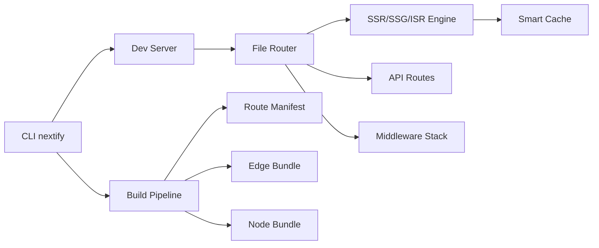

# Nextify.js

Nextify.js é um framework web moderno inspirado no Next.js, projetado para ser mais modular, rápido e escalável para aplicações React em ambientes Node.js e Edge.

## Visão geral do framework

Nextify.js combina:

- **React + TypeScript** como base de desenvolvimento.
- **Arquitetura modular** em pacotes (`core`, `cli`, `dev-server`, `build`).
- **Vite/esbuild** para desenvolvimento ultrarrápido e build otimizada.
- **Renderização híbrida** com SSR, SSG, ISR e Edge rendering.
- **DX de alto nível** com CLI, hot reload e sistema de plugins.
- **Segurança embutida** com middleware padrão contra ataques comuns.

## Contribuição de cada especialista

### 1) Arquiteto de Software Sênior
- Definiu uma arquitetura em camadas: `routing`, `rendering`, `cache`, `middleware`, `plugins`.
- Separou responsabilidades entre runtime de desenvolvimento e runtime de produção.
- Estruturou o framework como monorepo para evoluir módulos sem acoplamento rígido.

### 2) Especialista em React
- Adotou React 18 com streaming SSR (`renderToPipeableStream`).
- Estabeleceu convenções para `pages/` e componentes server/client.
- Priorizou suspense boundaries para UX progressiva.

### 3) Engenheiro de Performance Web
- Implementou **code splitting automático** por rota.
- Definiu cache inteligente por estratégia (`force-cache`, `stale-while-revalidate`, `no-store`).
- Planejou otimização de imagens com transformação por query string.

### 4) Engenheiro de Infraestrutura e DevOps
- Planejou deploy serverless com adaptadores (Vercel/AWS/Cloudflare).
- Criou build output independente por target (`node`, `edge`).
- Incluiu guideline de observabilidade e logs estruturados.

### 5) Especialista em Compiladores JavaScript
- Escolheu pipeline híbrido: Vite no dev + esbuild no build.
- Preparou transformações para API routes, middleware e manifestos de rotas.
- Definiu geração de `route-manifest.json` para runtime rápido.

### 6) Engenheiro de Experiência do Desenvolvedor (DX)
- Criou CLI `create-nextify` com scaffolding de projeto.
- Definiu mensagens de erro acionáveis e defaults produtivos.
- Priorizou hot reload extremamente rápido com HMR do Vite.

### 7) Especialista em Segurança Web
- Adicionou headers seguros por padrão (CSP, X-Frame-Options, nosniff).
- Definiu middleware de proteção contra CSRF e rate limit básico.
- Estabeleceu validação de entrada em API routes com schema.

## Arquitetura do sistema



### Fluxo de request
1. Request entra no runtime.
2. Middleware global é executado.
3. Router resolve rota baseada em arquivo.
4. Estratégia de renderização é aplicada (SSR/SSG/ISR/Edge).
5. Cache é consultado/atualizado.
6. Resposta é enviada com streaming quando possível.

## Estrutura de diretórios

```txt
nextify.js/
  packages/
    core/
      src/
        routing/
        rendering/
        cache/
        middleware/
        plugins/
    cli/
      src/
    dev-server/
      src/
    build/
      src/
  examples/
    blog/
      pages/
        index.tsx
        posts/[slug].tsx
        api/health.ts
```

## Implementação das funcionalidades principais

- ✅ File-based routing (`packages/core/src/routing/fileRouter.ts`)
- ✅ SSR com streaming (`packages/core/src/rendering/ssrEngine.ts`)
- ✅ SSG/ISR via geração estática + revalidação (`packages/core/src/rendering/ssg.ts`)
- ✅ API routes (`packages/core/src/routing/apiRoutes.ts`)
- ✅ Middleware (`packages/core/src/middleware/compose.ts`)
- ✅ Edge rendering por handler compatível com Fetch API
- ✅ Cache inteligente (`packages/core/src/cache/smartCache.ts`)
- ✅ Sistema de plugins (`packages/core/src/plugins/pluginSystem.ts`)

## Código exemplo

Ver arquivos na pasta `examples/blog` e `packages/*/src`.

## CLI do framework

```bash
npx create-nextify@latest my-app
cd my-app
npm run dev
```

Comandos planejados:
- `nextify dev`
- `nextify build`
- `nextify start`
- `nextify lint`

## Build system

- **Dev:** Vite + HMR + rota hot-reload.
- **Build:** esbuild com output separado server/client/edge.
- **Artifacts:** `dist/server`, `dist/client`, `dist/edge`, `route-manifest.json`.

## Deploy

Estratégias suportadas:
- **Serverless Node** (AWS Lambda, Vercel Functions)
- **Edge Workers** (Cloudflare Workers, Vercel Edge)
- **Container** (Docker para ambientes próprios)

## Como publicar no NPM

1. Atualizar versão:
   ```bash
   npm version patch
   ```
2. Buildar pacotes:
   ```bash
   npm run build
   ```
3. Publicar:
   ```bash
   npm publish --access public
   ```

## Como criar um projeto com Nextify.js

```bash
npx create-nextify@latest minha-app
cd minha-app
npm install
npm run dev
```

## Roadmap de evolução

1. React Server Components first-class.
2. Cache distribuído com drivers Redis/KV.
3. Image optimizer nativo com AVIF/WebP e CDN hints.
4. Analisador de bundle integrado na CLI.
5. Telemetria opcional de performance (Core Web Vitals).
6. Runtime unificado Node + Edge com adaptações automáticas.
